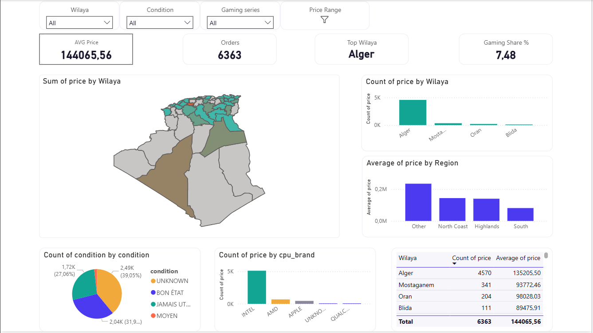

# Algerian Laptops Sales Analysis Dashboard

This repository contains a comprehensive Power BI project analyzing the computer and laptop market across Algeria. The dashboard provides insights into regional sales distribution, pricing trends, condition preferences, and hardware specifications (CPU, GPU, RAM).

## 📊 Dashboard Overview

The interactive Power BI dashboard allows users to filter and explore market data based on location (Wilaya), product condition, gaming series classification, and price range. 

**Key Metrics Tracked:**
*   **Average Price:** 144,065.56
*   **Total Orders:** 6,363
*   **Top Wilaya (Region):** Alger
*   **Gaming Share:** 7.48%

### Visualizations Included
*   **Geographical Heatmap:** Sum of prices distributed across Algerian Wilayas.
*   **Regional Price Distribution:** Average price breakdowns by region (North Coast, Highlands, South).
*   **Hardware Dominance:** Count of products by CPU brand (Intel heavily dominating, followed by AMD and Apple).
*   **Condition Breakdown:** Market share of product conditions (e.g., Bon État, Jamais Utilisé, Moyen).
*   **Performance Matrix:** Detailed table cross-filtering Wilaya with total counts and average prices.



## 🗄️ Data Model

The project utilizes a highly optimized **Star Schema** to manage relationships between hardware specifications, geographical data, and transactional facts. 


### Fact Table
*   **`data_preprocessed`**: The central fact table containing the core transactional/listing data.
    *   *Key metrics & foreign keys:* `price`, `condition`, `is_gaming_series`, `model_name`, `HDD_SIZE_GB`, `SSD_SIZE_GB`, `CPU.Index`, `GPU.Index`, `RAM.Index`, `Location`.

### Dimension Tables
The fact table is connected to four primary dimension tables via one-to-many relationships:

1.  **`CPU`** ([View Fields](image_5ef025.png))
    *   Fields: `cpu_brand`, `cpu_cores`, `cpu_family`, `cpu_generation`, `cpu_performance_class`, `cpu_suffix`, `Index`
2.  **`GPU`** ([View Fields](image_5ef05b.png))
    *   Fields: `gpu_brand`, `gpu_performance_class`, `gpu_suffix`, `gpu_tier`, `Index`, `Merged`
3.  **`RAM`** ([View Fields](image_5ef05b.png))
    *   Fields: `RAM_SIZE_GB`, `ram_type_class`, `Index`
4.  **`Location`** ([View Fields](image_5ef05b.png))
    *   Fields: `city`, `Region`, `Wilaya`, `Index`

## 🛠️ Technologies Used
*   **Power BI Desktop:** For data modeling, DAX measure creation, and visualization.
*   **Power Query:** Used for initial data cleaning, preprocessing (`data_preprocessed`), and structuring the dimension tables.

## 🚀 How to Use

1.  Clone this repository to your local machine:
    ```bash
    git clone [https://github.com/yourusername/algerian-pc-market-analysis.git](https://github.com/yourusername/algerian-pc-market-analysis.git)
    ```
2.  Ensure you have [Power BI Desktop](https://powerbi.microsoft.com/desktop/) installed.
3.  Open the `.pbix` file included in the repository.
4.  Use the slicers at the top of the dashboard (Wilaya, Condition, Gaming series, Price Range) to interact with the data and explore specific market segments.

## 📁 Repository Structure
*   `/data`: Raw and preprocessed datasets (if applicable/public).
*   `/dashboards`: The Power BI (`.pbix`) files.
*   `/images`: Screenshots of the dashboard and data model (`image_5eefe1.png`, `image_5ef025.png`, `image_5ef05b.png`, `image_5ef0ba.png`).
